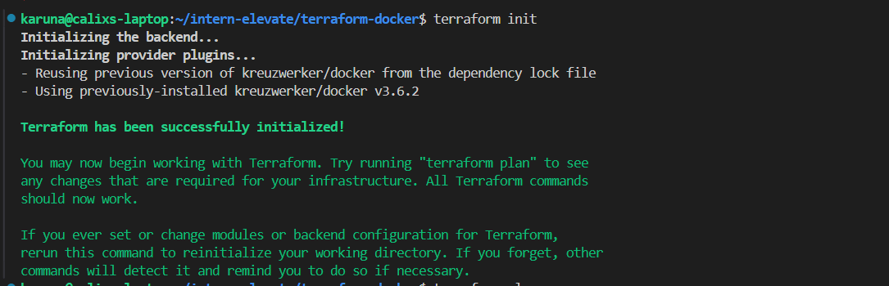
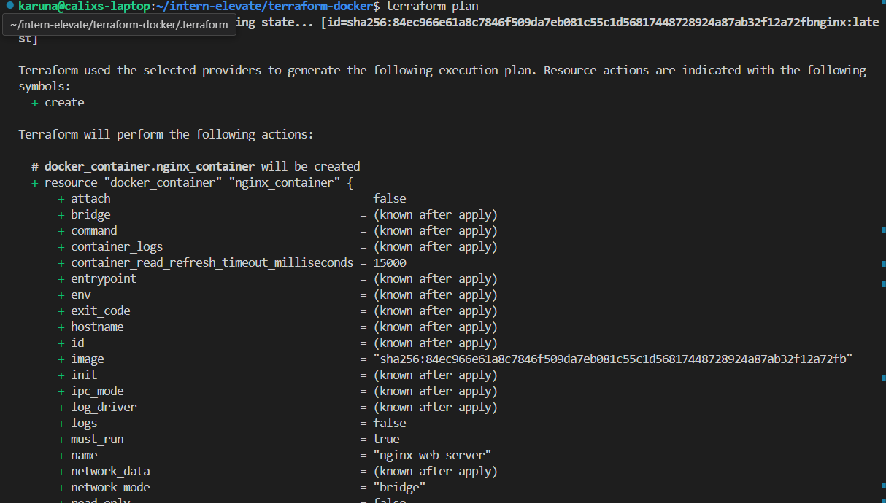
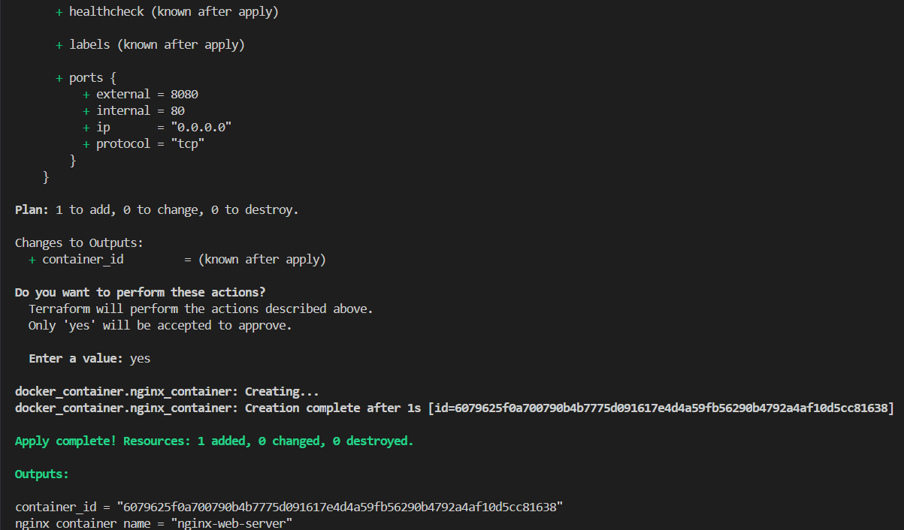

# Task 3: Infrastructure as Code with Terraform

This project uses Terraform to provision a local Docker container.

We have created three key files:

- **provider.tf**: Defines the Docker provider configuration.
- **main.tf**: Declares the Docker image and container resources.
- **outputs.tf**: Outputs the Docker image and container ID.

---

### Usage Instructions

To get started, run:

##terraform init

##terraform plan

##terraform apply

